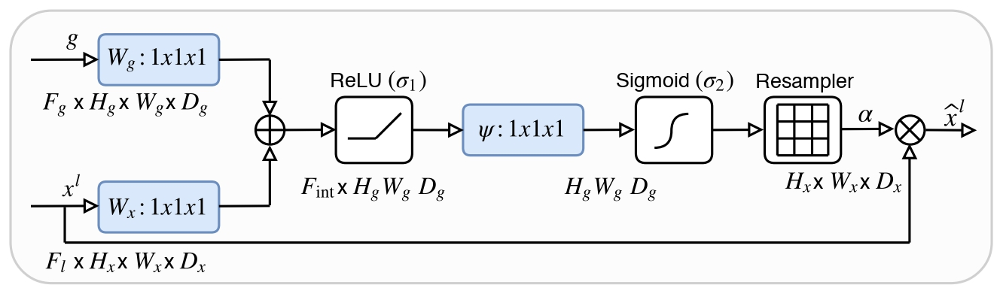

# Semantic Segmentation with FCN and U-Net Architectures

The primary goal is to assign a class label to every pixel in an image, effectively partitioning the image into meaningful segments like roads, buildings, cars, and pedestrians. The project leverages PyTorch for model implementation and Weights & Biases for experiment tracking and visualization.

## Models Implemented

This repository contains implementations for two families of semantic segmentation models, with several variations for each to explore different architectural concepts.

### 1. Fully Convolutional Networks (FCN)
Based on the paper ["Fully Convolutional Networks for Semantic Segmentation"](https://arxiv.org/abs/1411.4038), the following variants were implemented using a pre-trained VGG16 backbone:

-   **FCN-32s:** The simplest variant, with a single 32x upsampling from the final convolutional layer.
-   **FCN-16s:** Improves on FCN-32s by adding a skip connection from the `pool4` layer.
-   **FCN-8s:** Further refines the architecture with an additional skip connection from the `pool3` layer.


*Each FCN variant was trained in two modes: with the VGG16 backbone **frozen** and with the backbone **fine-tuned**.*

### 2. U-Net Architectures
Based on the paper ["U-Net: Convolutional Networks for Biomedical Image Segmentation"](https://arxiv.org/abs/1505.04597), the following models were built and compared:

-   **Standard U-Net:** The classic U-Net architecture with an encoder-decoder structure and skip connections.

-   **U-Net without Skip Connections:** A baseline model to demonstrate the impact of skip connections on performance.
-   **Residual U-Net:** Replaces standard convolutional blocks with residual blocks to explore improved gradient flow.
-   **Gated Attention U-Net:** Integrates attention gates into the skip connections to help the model focus on relevant features, based on ["Attention U-Net: Learning Where to Look for the Pancreas"](https://arxiv.org/abs/1804.03999).




---

## Key Results & Visualizations

### Quantitative Results

The following tables summarize the final test Mean Intersection over Union (mIoU) for all experiments, providing a clear comparison of model performance.

**FCN Variants (Test mIoU)**

| Model                       | Test mIoU |
| --------------------------- | :-------: |
| **FCN8s_vgg16_finetune**    | **0.891** |
| FCN16s_vgg16_finetune   |   0.878   |
| FCN8s_vgg16_freeze      |   0.850   |
| FCN32s_vgg16_finetune   |   0.844   |
| FCN16s_vgg16_freeze     |   0.814   |
| FCN32s_vgg16_freeze     |   0.789   |

**U-Net Variants (Test mIoU)**

| Model                          | Test mIoU |
| ------------------------------ | :-------: |
| **UNet_Standard_256**          | **0.974** |
| ResidualUNet_256               |   0.974   |
| AttentionResidualUNet_256      |   0.970   |
| UNet_NoSkip_256                |   0.811   |

### Training Performance

The validation mIoU curves show the learning progression and relative performance of the different models over epochs.

**FCN Variants (Validation mIoU)**


**U-Net Variants (Validation mIoU)**


### Qualitative Results

Visual inspection of model predictions provides insight into their segmentation quality. The FCN-8s model produces the most detailed segmentations among the FCNs, while the standard U-Net excels at capturing fine boundaries.

**FCN-8s (Fine-tuned) Predictions**
*(Top: Input Image, Middle: Ground Truth, Bottom: Prediction)*


**Standard U-Net Predictions**
*(Top: Input Image, Middle: Ground Truth, Bottom: Prediction)*


---

## Analysis & Key Findings

### FCN: The Power of Skip Connections
-   **FCN-32s** produces coarse, blurry segmentations because upsampling from a very low-resolution feature map (`pool5`) loses significant spatial detail.
-   **FCN-16s** improves this by fusing features from `pool4`, resulting in sharper boundaries and better localization of medium-sized objects.
-   **FCN-8s** consistently performs the best by incorporating even higher-resolution features from `pool3`. This allows it to preserve fine details and accurately segment smaller objects. The performance gain is clear both quantitatively (in mIoU) and qualitatively.

### Backbone: Freezing vs. Fine-tuning
-   **Freezing** the VGG16 backbone leads to faster training but limits performance, as the features are optimized for ImageNet classification, not segmentation.
-   **Fine-tuning** allows the network to adapt its feature extractors to the specific segmentation task. This provides a noticeable performance boost, especially for the more detailed FCN-8s model, where high-quality, task-specific features are crucial.

### U-Net: The Critical Role of Skip Connections
-   The **U-Net without skip connections** performs significantly worse than the standard U-Net. Its predictions are blurry, miss small objects entirely, and fail to align with object contours.
-   **Skip connections** are fundamental to U-Net's success. They reintroduce high-resolution spatial information from the encoder to the decoder, allowing the model to combine deep semantic context with precise localization detail. This leads to crisp boundaries and accurate segmentation of objects of all sizes.

### Advanced U-Net Blocks: Diminishing Returns
-   **Residual U-Net:** Using residual blocks instead of standard convolutional blocks did not yield a significant improvement. This suggests that for a relatively shallow (4-level) U-Net, standard convolutions are sufficient, and vanishing gradients are not a major issue.
-   **Attention U-Net:** Similarly, attention gates did not improve performance. AGs are most effective when the model needs to "focus" on specific regions and ignore irrelevant background (e.g., in medical imaging). In our dense segmentation task, where every pixel belongs to a class, there is no "irrelevant" region to suppress, making the attention mechanism less impactful.

### Dataset

Available at https://drive.google.com/file/d/10v-yWWb6NdEEOntcyG0hfVTAzlg9UkcX/view for FCNs and https://drive.google.com/file/d/1tPsnEyFybZiQ_teTRAz5sv4HiO6AyGhI/view for UNet. The code expects the dataset to be organized in the following structure. The project uses two different image sizes for the two main experiments.

For the **FCN experiments (Q1)**:
```
dataset_224/
├── train/
│   ├── images/
│   │   ├── 0000.png
│   │   └── ...
│   └── labels/
│       ├── 0000.png
│       └── ...
└── test/
    ├── images/
    └── labels/
```

For the **U-Net experiments (Q2)**:
```
dataset_256/
├── train/
│   ├── images/
│   └── labels/
└── test/
    ├── images/
    └── labels/
```

### Configuration

All hyperparameters (learning rate, batch size, number of epochs, etc.) and paths can be modified in the `config.py` file within each experiment's directory (`q1/config.py` and `q2/config.py`).

---

## Codebase Structure

The codebase is organized into two main modules, `fcn` and `unet`, which share a similar structure.

-   `main.py`: The main entry point to run all experiments for that part. It orchestrates model creation, training, and evaluation.
-   `models.py`: Contains the PyTorch implementations of corresponding neural network architectures 
-   `training.py`: Includes the core training and validation loops, testing logic, and visualization functions.
-   `data.py`: Defines the `SegmentationDataset` class and `get_dataloaders` function for loading and preprocessing the data.
-   `config.py`: A centralized file for all project configurations and hyperparameters.
-   `visualizations/`: Directory where prediction images are saved.

---

## Acknowledgments

This project was developed as an assignment for the **Computer Vision** course at IIITH. Parts of this readme are LLM generated.